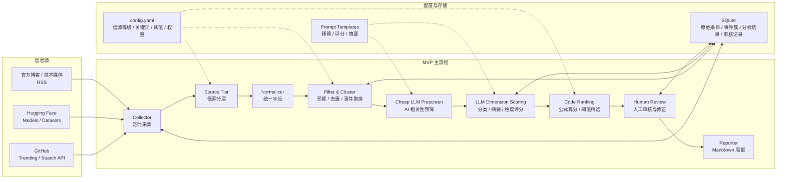

# AI 技术情报雷达方案设计

> 目标：为 5-8 人 AI Lab 设计一个 4 周内可由 1-2 人落地的技术情报 MVP，帮助团队持续跟踪 AI 技术动态，并形成可审核、可复盘的内部决策周报。

---

## 一、对题目的质疑与假设

### 1. 核心需求不是“发现更多信息”，而是“降低决策噪声”

AI 社区每天都有大量新模型、论文、框架和工具出现。对 Lab 决策者来说，真正困难的不是“有没有新东西”，而是：

- 哪些值得投入时间验证？
- 哪些只是短期热度？
- 哪些对当前团队有工程价值？
- 哪些需要继续观察，但暂时不值得投入？

因此，本方案不把系统定位成“全网信息聚合器”，而是定位成一个**带人工审核的人机协同情报筛选系统**。系统负责稳定采集、去重、初筛、摘要和评分；人负责最终判断、修正和发布。

### 2. 在 AI 信息场里，信源比信息更重要

同一条技术动态可能同时出现在官方博客、官方社媒、媒体转述、KOL 评论和社区讨论中。它们传递的是同一事件，但可信度、完整度和噪声水平不同。

所以 MVP 不应只回答“接入哪些平台”，还要回答“哪些信源更值得相信”。我假设首版采用三层信源分级：

| 信源等级 | 示例 | 处理策略 |
| --- | --- | --- |
| T1 | 官方博客、官方文档、项目仓库、论文主页 | 最高权重，优先作为事件主条目 |
| T1.5 | 官方社媒、核心团队成员账号、Release 页面 | 中高权重，用于补充发布时间和传播信号 |
| T2 | 技术媒体、KOL、社区讨论、聚合站点 | 低权重，用于观察热度，不直接主导推荐 |

这个分层不是为了扩大采集范围，而是为了让系统在多源报道同一事件时，优先展示更权威、更接近一手的信息。

### 3. MVP 不追求全自动，也不追求全覆盖

题目提到“智能化系统”，但没有明确自动化边界。我对 MVP 的假设是：

- 不做完全无人值守的自动决策。
- 不在首版覆盖所有信息源。
- 不把 LLM 评分当成最终结论。
- 不优先做复杂 Web Dashboard。

原因是 4 周、1-2 人的约束下，最关键的是先跑通一个稳定闭环：**采集真实信息 -> 形成候选列表 -> 生成分析草稿 -> 人工审核 -> 输出周报 -> 根据反馈调整规则**。

### 4. “工程价值”需要被拆成可讨论的判断维度

题目要求评估“工程价值与能力边界”，但未给出标准。MVP 阶段我将其拆成四个维度：

| 维度 | 关注问题 | 评分方式 |
| --- | --- | --- |
| 实用性 | 是否能在真实工程中试用或集成 | 1-5 分 |
| 影响力 | 社区、厂商或行业是否正在关注 | 1-5 分 |
| 跟进成本 | 学习、部署、算力、迁移成本是否可控 | 1-5 分，分数越高代表成本越低 |
| 能力边界 | 适合什么、不适合什么、风险在哪里 | 结构化文本 |

最终输出不只给分数，还要给一句明确建议：**建议跟进 / 保持观察 / 暂不投入**。

---

## 二、方案设计

### 2.1 架构图



### 2.2 关键模块

**Collector：信息采集**

MVP 只接入 3 类高确定性来源：

| 来源 | 选择原因 | MVP 采集内容 |
| --- | --- | --- |
| GitHub | 开源工具和框架的一线信号，API 成熟 | repo、描述、star、语言、更新时间、增长趋势 |
| Hugging Face | 新模型和数据集的主要发布平台 | model、task、downloads、likes、README 摘要 |
| 官方博客 / 技术媒体 RSS | 厂商和研究团队的一手信息 | 标题、摘要、发布时间、来源、链接 |

暂不把 X、Reddit、arXiv 作为 MVP 主链路。社交媒体 API 不稳定且噪声大；arXiv 论文量大、工程信号弱。它们可以在后续版本作为补充源。

**Source Tier：信源分层**

采集到的信息先标记信源等级，而不是直接进入评分。首版用配置文件维护信源清单：

```yaml
sources:
  - name: OpenAI Blog
    url: https://openai.com/news/rss.xml
    tier: T1
    type: official_blog
  - name: Hugging Face Blog
    url: https://huggingface.co/blog/feed.xml
    tier: T1
    type: official_blog
  - name: GitHub Trending AI
    url: github_search:topic:artificial-intelligence
    tier: T1.5
    type: repo_index
```

信源等级会影响两个环节：事件聚类时谁作为主条目，以及最终综合分的权重。

**Normalizer：统一数据结构**

不同来源统一成同一种 `TechItem`：

```json
{
  "source": "github",
  "source_tier": "T1.5",
  "title": "vLLM project update",
  "url": "https://github.com/vllm-project/vllm",
  "description": "High-throughput LLM inference engine",
  "published_at": "2026-06-01",
  "metrics": {
    "stars": 85000,
    "weekly_growth": 1200
  }
}
```

**Filter & Cluster：降噪和事件聚类**

首版只做可解释规则：

- URL 完全相同则去重。
- 标题相似度高且来源不同则合并。
- GitHub 项目低于 star / 增长阈值则过滤。
- RSS 文章不包含配置关键词则过滤。
- 已连续多期出现但无新增变化的条目降权。

此外，系统需要把“同一事件的多源报道”聚成一个事件簇。MVP 可以先用标题相似度、URL 域名、发布时间窗口和关键词重叠做基础聚类，不急于引入复杂 embedding。

事件簇只展示一个主条目，其余报道折叠为相关链接。主条目优先级为：

```text
官方博客 / 官方文档 > 项目仓库 / Release > 官方社媒 > 权威媒体 > KOL / 社区讨论
```

这个设计能避免同一件事被多家媒体报道后重复进入 Top 推荐。

**LLM Prescreen + Dimension Scoring：两阶段模型处理**

LLM 不直接决定“是否精选”。首版拆成两段：

1. 低成本预筛：判断条目是否真的与 AI 技术相关。无关条目直接落库，不进入后续评分。
2. 高质量维度评分：只对通过预筛的条目做分类、摘要、维度评分和能力边界分析。

维度评分只要求模型输出结构化结果：

```json
{
  "category": "tool_framework",
  "summary": "vLLM 是面向大模型推理服务的高吞吐框架。",
  "scores": {
    "practicality": 5,
    "influence": 5,
    "follow_cost": 4
  },
  "boundary": {
    "good_for": "在线推理、批量推理、模型服务化",
    "not_good_for": "提升模型本身能力或训练质量",
    "risks": "需要确认 CUDA、显卡和现有服务框架兼容性"
  }
}
```

**Code Ranking：代码化综合评分**

最终推荐不由 LLM 一句话判断，而由代码按固定公式计算：

```text
quality_score =
  0.35 * practicality
+ 0.30 * influence
+ 0.20 * follow_cost
+ 0.10 * source_tier_weight
+ 0.05 * freshness
```

不同类别使用不同精选阈值。例如 T1 官方发布的模型更新可以用较低阈值进入观察列表，而 T2 KOL 评论需要更高分才进入推荐。这样做的好处是可控、可调、可回测：如果推荐质量不好，优先调整权重和阈值，而不是继续堆长 Prompt。

**Human Review：人工审核**

这是 MVP 的关键环节。系统每天生成候选列表，Lab 成员每周花 30-60 分钟审核：

- 删除明显误判项。
- 修改 LLM 过度乐观或过度概括的判断。
- 补充团队内部语境，例如“是否和当前项目相关”。
- 标记“推荐正确 / 推荐过高 / 遗漏重要信息”，用于后续回测。
- 最终确认 Top 5 推荐和观察列表。

**Reporter：周报输出**

MVP 输出 Markdown 周报，可直接放入飞书文档、邮件或 GitHub 仓库。首版不做 Web 页面，因为周报更贴近决策者消费习惯，也更容易在 4 周内交付。

### 2.3 周报样例

```markdown
# AI 技术情报周报 2026-W23

## 本周结论

- 建议跟进：3 项
- 保持观察：7 项
- 暂不投入：18 项

## Top 推荐

### 1. vLLM 新版本：推理吞吐和部署能力增强

- 事件主条目：GitHub Release / vLLM 官方仓库
- 信源等级：T1.5
- 相关报道：3 条，已折叠
- 分类：工具框架
- 综合建议：建议跟进
- 综合分：4.65/5
- 分数来源：LLM 给出实用性 5、影响力 5、跟进成本 4；代码结合信源等级、发布时间和类别阈值计算最终分。
- 推荐理由：vLLM 已是高吞吐 LLM 推理的重要工程组件，本次更新增强了部署稳定性，适合内部模型服务团队验证。
- 能力边界：适合在线推理和批量推理服务；不适合直接解决模型质量问题；需要确认现有显卡、CUDA 版本和服务框架兼容性。
- 建议动作：安排 0.5 人日复现实验，比较当前推理框架的吞吐、显存占用和部署复杂度。
```

---

## 三、关键设计决策

### 1. 为什么不在 MVP 使用 Agent 架构？

MVP 主流程是确定性的：采集、清洗、分析、审核、输出。每一步输入输出都可以提前定义，不需要让 Agent 自主规划下一步。

Agent 架构的优势在于开放式探索、动态工具调用和多步调研，但它也会带来三个问题：

- 成本不可控：多轮调用会放大 token 和 API 成本。
- 行为不可预测：同一输入可能产生不同路径。
- 调试困难：出错时难以定位是工具、提示词还是规划问题。

所以 MVP 采用固定 Pipeline。后续可以在“深度调研某个高分条目”时引入轻量 Agent，但不作为主链路。

### 2. 为什么“能用代码处理的，不交给模型”？

信息筛选里有两类问题：一类需要语义理解，例如“这条信息讲的是什么”“它适合什么场景”；另一类是确定性计算，例如信源权重、时间衰减、去重合并、类别阈值。

前者适合交给 LLM，后者应尽量用代码完成。原因是代码规则更可控、可解释、可回测，也更便宜。MVP 中 LLM 只负责维度判断，最终综合分、是否精选、主条目选择都由代码执行。

### 3. 为什么 LLM 只做维度评分，不做最终精选判断？

如果让 LLM 同时负责分类、摘要、打分、判断是否精选，它很容易被热度、措辞和上下文缺失影响，且每次 Prompt 调整都难以评估真实效果。

因此本方案把 LLM 的任务收窄为“输出相对稳定的维度分和结构化解释”。最终精选由代码根据维度分、信源等级、事件类型和阈值计算。这样可以用历史样本回测不同权重组合，逐步逼近团队真实偏好。

### 4. 为什么先做 Markdown 周报，而不是 Web Dashboard？

Dashboard 更适合查询历史、协同标注和趋势分析，但首版的主要问题是“能不能筛出有价值的东西”。Markdown 周报具备三个优势：

- 实现成本低，1-2 人可快速交付。
- 便于人工审核和二次编辑。
- 决策者不需要学习新系统，可以直接在飞书或邮件中阅读。

如果周报连续 3-4 周被团队使用，再建设 Dashboard 才有明确需求基础。

### 5. 为什么要保留人工审核？

LLM 可以帮助摘要和初筛，但它不适合直接替代技术判断，尤其是：

- 容易被项目热度误导。
- 对 license、部署成本、团队适配度判断不稳定。
- 对“是否值得本团队跟进”的上下文不足。

因此本系统不是“自动决策系统”，而是“辅助决策系统”。人工审核不是低效环节，而是质量控制环节。

### 6. 4 周 MVP 计划

| 周次 | 目标 | 产出 |
| --- | --- | --- |
| Week 1 | 跑通 GitHub 单源链路 | 项目骨架、SQLite 表结构、GitHub 采集、统一数据结构、手动候选列表 |
| Week 2 | 接入 Hugging Face 和 RSS，完成信源分层和基础聚类 | 多源采集、信源等级配置、URL 去重、标题相似度合并、基础事件簇 |
| Week 3 | 接入两阶段 LLM 分析和代码化评分 | AI 相关性预筛、分类摘要、维度评分、综合评分公式、Markdown 周报 |
| Week 4 | 内测、回测和规则调优 | 连续运行 2-3 轮、小规模历史样本回测、人工反馈记录、阈值调整、使用说明 |

### 7. 后续演进

| 阶段 | 能力 |
| --- | --- |
| V1 MVP | 固定 Pipeline、三类信息源、信源分层、事件聚类、Markdown 周报、人工审核 |
| V2 | 引入 arXiv / Papers with Code、历史趋势、语义搜索、飞书推送 |
| V3 | Web Dashboard、团队协作、标签体系、轻量 Agent 深度调研 |

---

## 四、LLM 使用说明

### 1. 使用范围

本方案允许并使用 LLM 辅助完成，主要用于：

- 梳理题目要求和交付结构。
- 生成方案初稿。
- 比较 Agent 架构与固定 Pipeline 的取舍。
- 将参考材料中的工程经验提炼为方案机制，例如信源分层、两阶段模型处理、代码化评分和事件聚类。
- 改写文档表达，使其更适合 3-5 页方案交付。
- 生成 Mermaid 架构图和周报样例。

### 2. 人工主导的内容

以下判断由人工确认和取舍：

- MVP 不做全自动决策，采用人机协同。
- 首版收敛到 GitHub、Hugging Face、RSS 三类来源。
- 主链路不采用 Agent 架构。
- 首版输出 Markdown 周报，不做 Web Dashboard。
- 工程价值拆成实用性、影响力、跟进成本、能力边界四类判断。
- LLM 只输出维度分和结构化解释，最终精选由代码化规则完成。

### 3. 人工修改原因

| 修改点 | 修改原因 |
| --- | --- |
| 压缩信息源范围 | 避免 4 周 MVP 范围失控 |
| 增加信源分层 | 让系统优先相信一手信息，降低二手转述噪声 |
| 增加两阶段模型处理 | 用低成本预筛控制成本，用高质量模型处理关键条目 |
| 增加代码化评分 | 避免 LLM 直接决定最终推荐，提高可控性和可回测性 |
| 增加事件聚类 | 避免同一事件被多源重复报道后刷屏 |
| 强化人工审核环节 | 保证输出质量和可追责 |
| 补充样例周报 | 让评审能看到最终交付形态 |
| 弱化 Agent 主链路 | 降低实现复杂度和不确定性 |
| 明确 4 周计划 | 体现实习落地可执行性 |

### 4. 使用的模型和工具

| 工具 / 模型 | 用途 |
| --- | --- |
| Codex / GPT-5 | 阅读题目、分析现有方案、吸收参考材料、协助重写 Markdown 文档 |
| PowerShell | 查看项目文件和文档内容 |
| Mermaid | 绘制架构图 |

### 5. 使用原则

LLM 在本次任务中承担“结构化表达”和“方案迭代助手”的角色，不作为最终判断来源。所有关键取舍均经过人工确认，尤其是 MVP 范围、架构复杂度、信息源选择、评分机制和输出形式。
